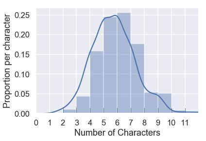

```python
# HIDDEN
import warnings
# Ignore numpy dtype warnings. These warnings are caused by an interaction
# between numpy and Cython and can be safely ignored.
# Reference: https://stackoverflow.com/a/40846742
warnings.filterwarnings("ignore", message="numpy.dtype size changed")
warnings.filterwarnings("ignore", message="numpy.ufunc size changed")

import numpy as np
import matplotlib.pyplot as plt
import pandas as pd
import seaborn as sns
%matplotlib inline
import ipywidgets as widgets
from ipywidgets import interact, interactive, fixed, interact_manual
import nbinteract as nbi

sns.set()
sns.set_context('talk')
np.set_printoptions(threshold=20, precision=2, suppress=True)
pd.options.display.max_rows = 7
pd.options.display.max_columns = 8
pd.set_option('precision', 2)
# This option stops scientific notation for pandas
# pd.set_option('display.float_format', '{:.2f}'.format)
```


```python
# HIDDEN
students = pd.read_csv('roster.csv')
students['Name'] = students['Name'].str.lower()
```

## Exploratory Data Analysis

The term Exploratory Data Analysis (EDA for short) refers to the process of discovering traits about our data that inform future analysis.

Here's the `students` table from the previous page:


```python
students
```


<div>
<style scoped>
    .dataframe tbody tr th:only-of-type {
        vertical-align: middle;
    }

    .dataframe tbody tr th {
        vertical-align: top;
    }

    .dataframe thead th {
        text-align: right;
    }
</style>
<table border="1" class="dataframe">
  <thead>
    <tr style="text-align: right;">
      <th></th>
      <th>Name</th>
      <th>Role</th>
    </tr>
  </thead>
  <tbody>
    <tr>
      <th>0</th>
      <td>keeley</td>
      <td>Student</td>
    </tr>
    <tr>
      <th>1</th>
      <td>john</td>
      <td>Student</td>
    </tr>
    <tr>
      <th>2</th>
      <td>bryan</td>
      <td>Student</td>
    </tr>
    <tr>
      <th>...</th>
      <td>...</td>
      <td>...</td>
    </tr>
    <tr>
      <th>276</th>
      <td>ernesto</td>
      <td>Waitlist Student</td>
    </tr>
    <tr>
      <th>277</th>
      <td>athan</td>
      <td>Waitlist Student</td>
    </tr>
    <tr>
      <th>278</th>
      <td>michael</td>
      <td>Waitlist Student</td>
    </tr>
  </tbody>
</table>
<p>279 rows × 2 columns</p>
</div>


We are left with a number of questions. How many students are in this roster? What does the `Role` column mean? We conduct EDA in order to understand our data more thoroughly.

Oftentimes, we explore the data by repeatedly posing questions as we uncover more information.

**How many students are in our dataset?**


```python
print("There are", len(students), "students on the roster.")
```

    There are 279 students on the roster.


A natural follow-up question: does this dataset contain the complete list of students? In this case, this table contains all students in one semester's offering of Data 100.

**What is the meaning of the `Role` field?**

We often example the field's data in order to understand the field itself.


```python
students['Role'].value_counts().to_frame()
```


<div>
<style scoped>
    .dataframe tbody tr th:only-of-type {
        vertical-align: middle;
    }

    .dataframe tbody tr th {
        vertical-align: top;
    }

    .dataframe thead th {
        text-align: right;
    }
</style>
<table border="1" class="dataframe">
  <thead>
    <tr style="text-align: right;">
      <th></th>
      <th>Role</th>
    </tr>
  </thead>
  <tbody>
    <tr>
      <th>Student</th>
      <td>237</td>
    </tr>
    <tr>
      <th>Waitlist Student</th>
      <td>42</td>
    </tr>
  </tbody>
</table>
</div>


We can see here that our data contain not only students enrolled in the class at the time but also the students on the waitlist. The `Role` column tells us whether each student is enrolled.

**What about the names?  How can we summarize this field?**

In Data 100 we will work with many different kinds of data, including numerical, categorical, and text data. Each type of data has its own set of tools and techniques.

A quick way to start understanding the names is to examine the lengths of the names.


```python
sns.distplot(students['Name'].str.len(),
             rug=True,
             bins=np.arange(12),
             axlabel="Number of Characters")
plt.xlim(0, 12)
plt.xticks(np.arange(12))
plt.ylabel('Proportion per character');
```





This visualization shows us that most names are between 3 and 9 characters long. This gives us a chance to check whether our data seem reasonable — if there were many names that were 1 character long we'd have good reason to re-examine our data.

### What's in a Name?

Although this dataset is rather simple, we will soon see that first names alone can reveal quite a bit about our group of students.
